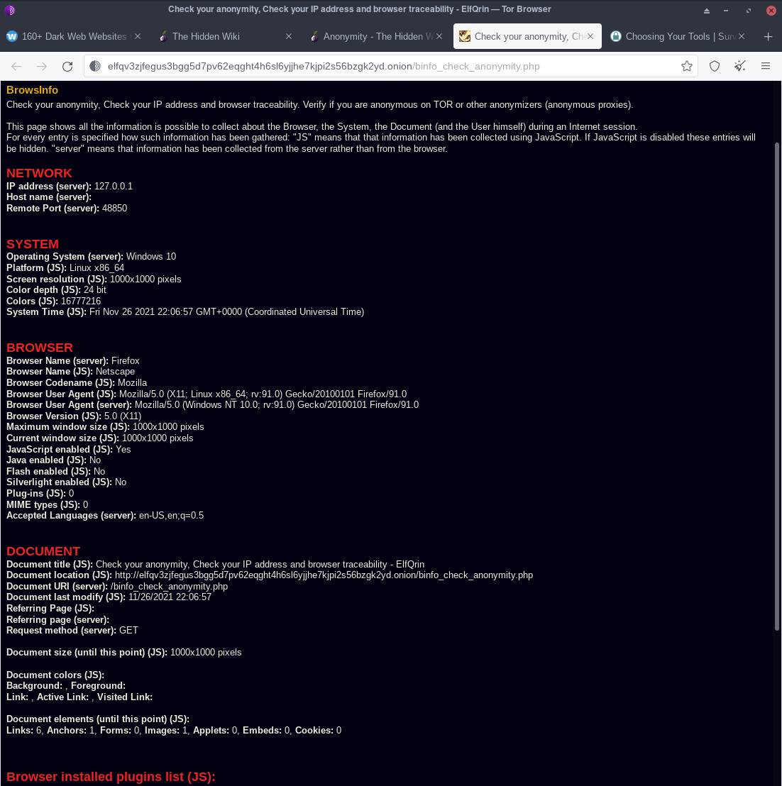

# Documentazione

## Why is the first IP address in my relay circuit always the same?

That is normal Tor behavior. The first relay in your circuit is called an "entry guard" or "guard". It is a fast and stable relay that remains the first one in your circuit for 2-3 months in order to protect against a known anonymity-breaking attack. The rest of your circuit changes with every new website you visit, and all together these relays provide the full privacy protections of Tor. For more information on how guard relays work, see this blog post and paper on entry guards.

## What attacks remain against onion routing?

As mentioned above, it is possible for an observer who can view both you and either the destination website or your Tor exit node to correlate timings of your traffic as it enters the Tor network and also as it exits. Tor does not defend against such a threat model.

In a more limited sense, note that if a censor or law enforcement agency has the ability to obtain specific observation of parts of the network, it is possible for them to verify a suspicion that you talk regularly to your friend by observing traffic at both ends and correlating the timing of only that traffic. Again, this is only useful to verify that parties already suspected of communicating with one another are doing so. In most countries, the suspicion required to obtain a warrant already carries more weight than timing correlation would provide.

Furthermore, since Tor reuses circuits for multiple TCP connections, it is possible to associate non anonymous and anonymous traffic at a given exit node, so be careful about what applications you run concurrently over Tor. Perhaps even run separate Tor clients for these applications.

## Do I get better anonymity if I run a relay?

Yes, you do get better anonymity against some attacks.

The simplest example is an attacker who owns a small number of Tor relays. They will see a connection from you, but they won't be able to know whether the connection originated at your computer or was relayed from somebody else.

There are some cases where it doesn't seem to help: if an attacker can watch all of your incoming and outgoing traffic, then it's easy for them to learn which connections were relayed and which started at you. (In this case they still don't know your destinations unless they are watching them too, but you're no better off than if you were an ordinary client.)

There are also some downsides to running a Tor relay. First, while we only have a few hundred relays, the fact that you're running one might signal to an attacker that you place a high value on your anonymity. Second, there are some more esoteric attacks that are not as well-understood or well-tested that involve making use of the knowledge that you're running a relay -- for example, an attacker may be able to "observe" whether you're sending traffic even if they can't actually watch your network, by relaying traffic through your Tor relay and noticing changes in traffic timing.

It is an open research question whether the benefits outweigh the risks. A lot of that depends on the attacks you are most worried about. For most users, we think it's a smart move.

# Link utili
- https://gitlab.torproject.org/legacy/trac/-/wikis/TorRelayGuide
- https://fossbytes.com/tor-anonymity-things-not-using-tor/
- http://zqktlwiuavvvqqt4ybvgvi7tyo4hjl5xgfuvpdf6otjiycgwqbym2qad.onion/wiki/Anonymity
- https://witestlab.poly.edu/blog/de-anonymizing-tor-traffic-with-website-fingerprinting/
- https://resources.infosecinstitute.com/topic/hacking-tor-network-follow/
- https://github.com/Attacks-on-Tor/Attacks-on-Tor

# Considerazioni 
Il paper TorBT.pdf spiega due tipi di exploit, ovvero usando BitTorrent e usando un form in una pagina html che *non* garantisce l'anonimato. 
Un modo piu' semplice e' sicuramente loggarsi da qualche parte usando le proprie credenziali gia' usate in precedenza in un contesto non-TOR.
Altro modo per rendersi *non anomini* e'postare informazioni personali.
Inviare traffico in chiaro.
I cookie e il local storage *restano* nel browser quindi ad un'analisi forense per esempio risultano 

i browser fingerprint 

la maggior parte sono sbagliati. e' buono cosi

anche le transazioni di bitcoin possono essere usare per deanonimizzare un utente della rete tor

